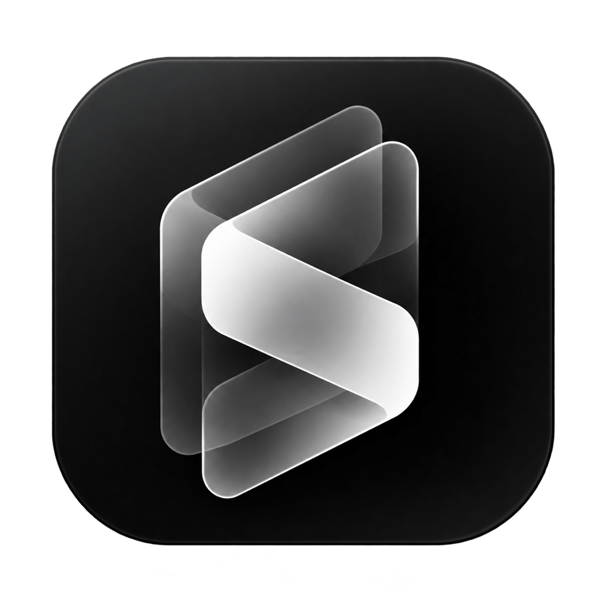

# LessonStudio

Gravador para macOS pensado para aulas, cursos, tutoriais e vídeos explicativos,
com tela, câmera e áudio em uma composição personalizável.

**Versão 0.1, beta 1. Disponível para avaliação, não para uso crítico.**

> Esta beta usa assinatura local de desenvolvimento e não está notarizada pela
> Apple. O macOS pode bloquear sua abertura em outro computador. Não desative
> as proteções do sistema para testar. Leia [Instalação](docs/INSTALACAO.md).

## Download

**[Baixar LessonStudio 0.1 Beta 1](https://github.com/Devliviax/LessonStudio/releases/download/v0.1.0-beta.1/LessonStudio-0.1-beta1-apple-silicon.dmg)**

[Notas e arquivos da release](https://github.com/Devliviax/LessonStudio/releases/tag/v0.1.0-beta.1)
incluem o arquivo `.sha256` para conferir a integridade do download.
Esta release é um pré-lançamento, não uma versão final.

## Compatibilidade

| Requisito | Beta atual |
| --- | --- |
| Processador | Apple Silicon: família M1 ou mais recente |
| Sistema | macOS 14 Sonoma ou mais recente |
| Macs Intel | Não suportados por este instalador |
| Interface | Português |

## Recursos

- Gravar uma tela inteira, uma janela ou usar uma imagem como conteúdo.
- Selecionar a câmera e o microfone; incluir som do sistema quando desejado.
- Ver tela e câmera reais antes de gravar e ajustar a composição.
- Mover a câmera na prévia, mudar formato, tamanho, cantos e enquadramento.
- Usar câmera no canto, aula dividida, somente tela ou layouts de Reels.
- Personalizar fundo, margens, cantos, borda e sombra.
- Aplicar efeitos de cursor, cliques, zoom, foco e privacidade à gravação.
- Acompanhar o mouse no enquadramento de Reels.
- Reproduzir o resultado e exportar em MP4.

| Formato | Resolução de saída |
| --- | --- |
| Horizontal 16:9 | 1920 × 1080 |
| Quadrado 1:1 | 1080 × 1080 |
| Vertical 9:16 | 1080 × 1920 |

## Primeiro Vídeo

1. Instale e conceda as permissões necessárias conforme o [guia de instalação](docs/INSTALACAO.md).
2. No painel da direita, escolha a fonte: **Tela inteira**, **Janela** ou **Imagem**.
3. Selecione câmera e microfone e confira a prévia.
4. Ajuste layout, formato, câmera e efeitos antes de iniciar.
5. Grave um trecho curto, pare e reproduza o resultado.
6. Exporte o MP4 e confira-o fora do aplicativo.

A prévia de preparação mostra a composição, mas não processa os efeitos de
gravação. Durante a gravação, ela é ocultada para reduzir o trabalho de exibição;
a captura continua com os efeitos configurados. Isso não garante desempenho
igual em todos os Macs. Veja [Uso](docs/USO.md).

## Teste e Suporte

- [Roteiro para testar a beta](docs/TESTES.md)
- [Problemas conhecidos e permissões](docs/PROBLEMAS-CONHECIDOS.md)
- [Notas da versão](CHANGELOG.md)

Para relatar uma falha, [abra uma Issue](https://github.com/Devliviax/LessonStudio/issues/new?template=problema.yml)
usando o formulário de problema.
Não envie senhas, e-mails privados ou gravações com dados pessoais.

Este repositório é destinado à documentação e à distribuição da beta.
O código-fonte, certificados de assinatura, gravações e arquivos pessoais
não fazem parte desta publicação.
